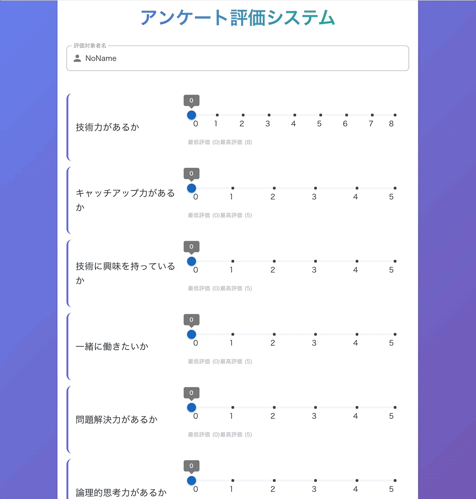

# Survey Web App with Vue.js
---

## プロジェクト概要 (Japanese Translation)

このプロジェクトは、Vue.js を使用して作成されたウェブアプリケーションで、ユーザーがアンケートを作成、回答、管理することができます。アンケートの応答を保存したり、質問を編集したり、データをエクスポートしたりする機能を備えています。

* ウェブサイト
  [https://t00m00.github.io/survey-web-app-with-vue/](https://t00m00.github.io/survey-web-app-with-vue/)

## 特徴

*   アンケートの名前を入力できます。
*   ブラウザの `localStorage` に自動でアンケートの回答を保存します。
*   以前保存したアンケートデータを `localStorage` から読み込みます。
*   `localStorage` に保存されたアンケートデータを削除できます。
*   アンケート回答を JSON ファイルとしてエクスポートできます。
*   個別のアセスメント項目のスコアをスライダーで表示および調整できます。
*   アンケートの合計スコアと最大可能スコアを表示します。
*   "編集モード" を有効にしてアセスメント項目を管理でき、以下が可能です:
    *   既存のアセスメント項目の視点（質問文やラベル）を修正できます。
    *   カスタマイズ可能な最大スコア（1-10）を持つ新しいアセスメント項目を追加できます。
    *   既存のアセスメント項目を削除できます。

This project is a web application built with Vue.js that allows users to create, complete, and manage surveys. It provides features for saving responses, editing survey questions, and exporting data.

* Web site
[https://t00m00.github.io/survey-web-app-with-vue/](https://t00m00.github.io/survey-web-app-with-vue/)

## Features

*   Enter a name for the survey.
*   Automatically saves survey responses to the browser's `localStorage`.
*   Load previously saved survey data from `localStorage`.
*   Delete saved survey data from `localStorage`.
*   Export survey responses as a JSON file.
*   View and adjust scores for individual assessment items using sliders.
*   Displays the total score and the maximum possible score for the survey.
*   Enable "Edit Mode" to manage assessment items, which allows you to:
    *   Modify the perspective (i.e., the question text or label) of existing assessment items.
    *   Add new assessment items with a customizable maximum score (1-10).
    *   Delete existing assessment items.

---
